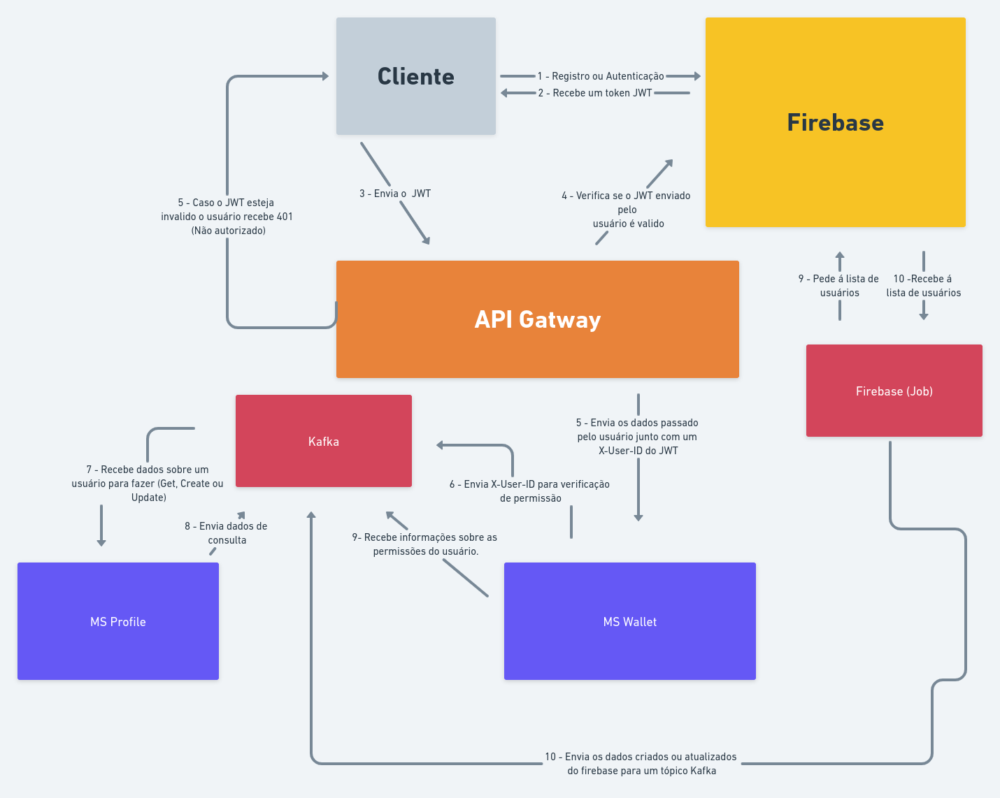

# Wings


O objetivo deste projeto é criar uma prova de conceito (POC) de um fluxo de autenticação e autorização desacoplado baseado em uma arquitetura orientada a eventos. Para isso, serão utilizadas tecnologias como Firebase, Gravitee API Gateway, Clojure, RedPanda e sitema de Profile.

O sistema resultante permitirá definir e gerenciar diferentes tipos de acesso para usuários com base em seus perfis, oferecendo maior segurança e controle de acesso aos dados. Além disso, a implementação será feita em etapas, visando a integração do Firebase para autenticação e armazenamento de dados básicos do usuário, a criação de um sistema de perfil para gerenciar as permissões dos usuários, um micro-serviço de exemplo simples (CRUD) e a configuração de um API Gateway para controlar o acesso aos recursos da API.

Ao final do projeto, espera-se ter desenvolvido um sistema de autenticação e autorização escalável e altamente seguro, com fluxos de trabalho otimizados para facilitar o gerenciamento e a manutenção contínua do sistema.

## Mind Map



A arquitetura de autenticação e autorização descrita neste mind map, utiliza o Firebase para autenticação e o API Gateway como intermediário para proteger os microserviços. O Firebase é responsável por emitir tokens de acesso que são verificados pelo API Gateway fazendo uma requisição para endpoint de JWKS do Google.

## Step: 1
O fluxo começa com o usuário acessando o endpoint http://127.0.0.1:8080 para fazer login ou http://127.0.0.1:8080/signup.html para cadastro, na pagina web as credencias coletadas na pagina são enviadas para o Firebase para autenticação ou criação de conta, após isso um token de acesso com as informações do usuário e gerado pelo Firebase é enviado para o usuário, ou seja toda á parte de autenticação e criação da conta é responsabilidade do Firebase.

## Step: 2
Quando o usuário faz uma solicitação a API via API Gateway, o token `jwt` é adicionado no cabeçalho da solicitação no campo `Authorization` como `Bearer`.

```bash
curl --request GET \
  --url http://127.0.0.1:8080/wallet/balance \
  --header 'Authorization: Bearer <Token>' \
```

o API Gateway pega o token e usa o Firebase para validar o token, após isso o API Gateway extrai o user_id do token e modifica á solicitação para o micro-serviços adicionando um novo cabeçalho com á chave `User-Id`, e também remove o `Authorization` do cabeçalho da solicitação, após isso ele envia uma solicitação para o micro-serviço de destino com estes novos dados.

```bash
curl --request GET \
  --url http://127.0.0.1:8080/wallet/balance \
  --header 'User-Id: FdLFFIiGIGISxckVKeXPPOdWSfOz' \
```

## Step: 3
O microserviço recebe á solicitação e cria um novo evento para um tópico do Kafka para que ele verifique se o usuário pode acessar aquele recurso:

```json
{
  "type": "GET",
  "id": "FdLFFIiGIGISxckVKeXPPOdWSfOz"
}
```

o microserviço de profile recebe o envento do kafka, pega as permissões no banco de dados referente a o usuário e cria um novo evento para o kafka, o microserviço que fez á solicitação então recebe estes dados e o mesmo verifica se o usuário pode ou não acessar aquele recurso, se ele for autorizado á aplicação cria uma resposta e envia para o usuário caso contrario envia 401.
